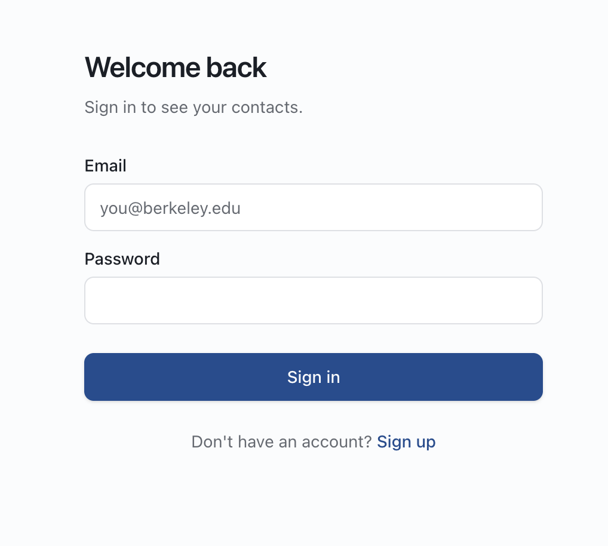
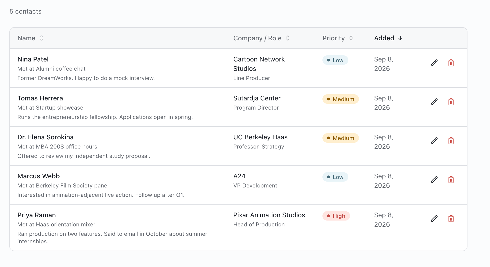
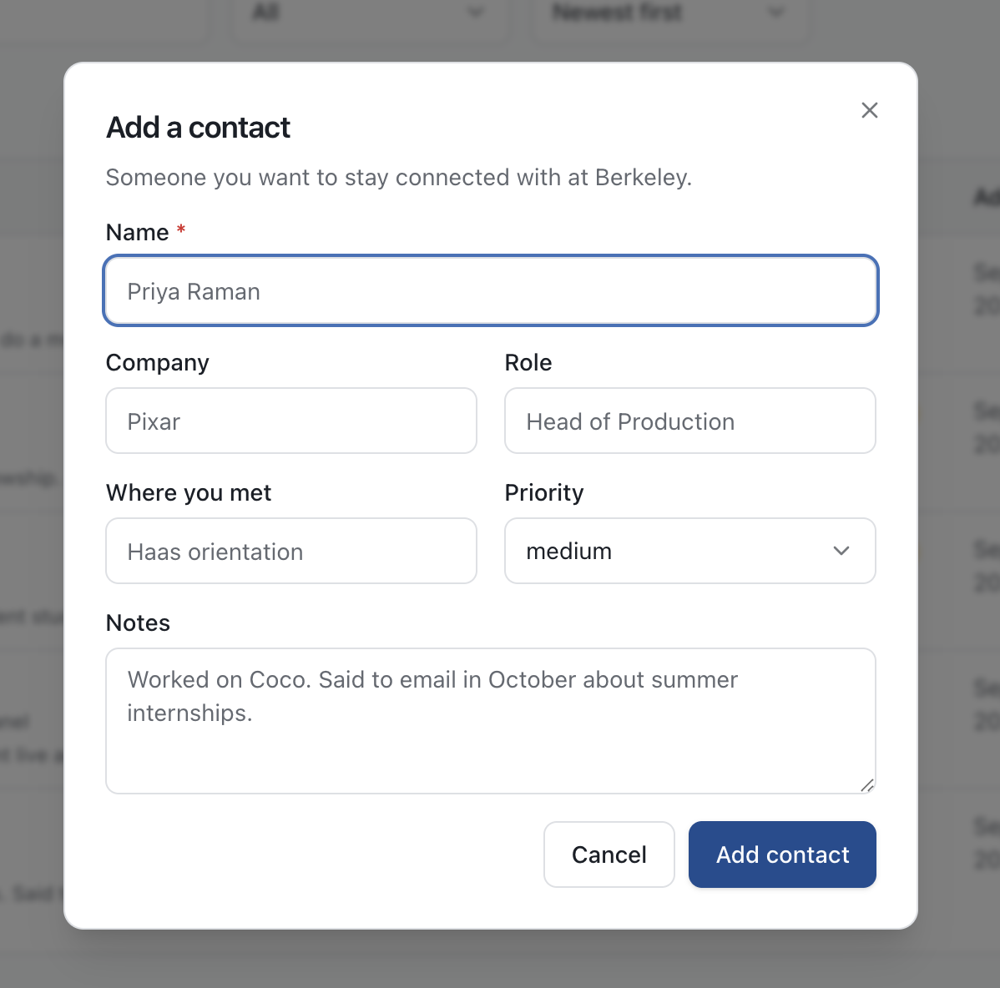
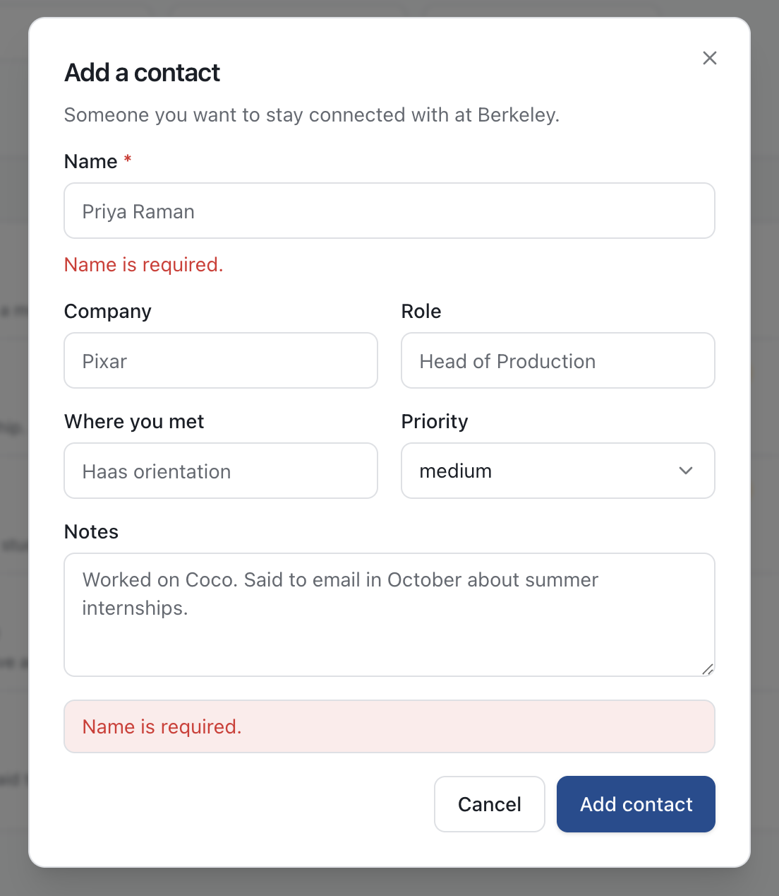
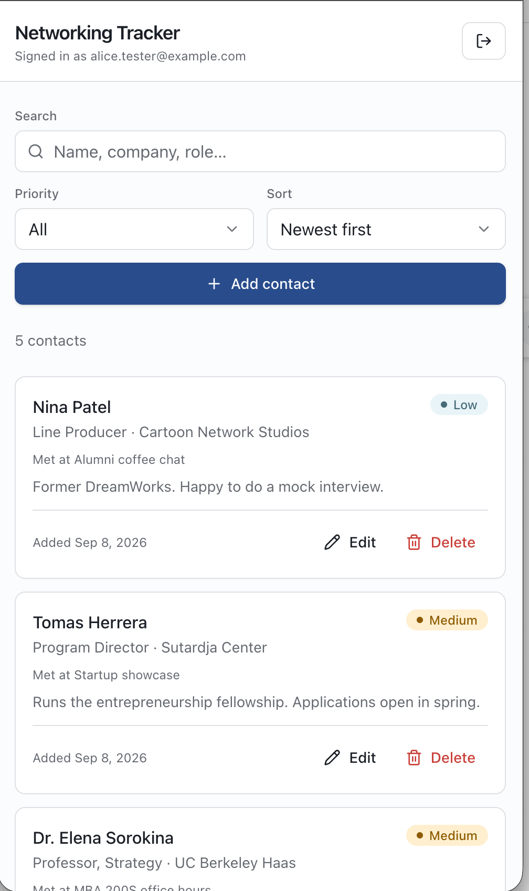

# Berkeley Networking Tracker

A private contact tracker for the people you want to stay connected with at Berkeley. Each signed-in user gets their own list — add someone with their company, role, where you met, free-form notes, and a high/medium/low priority, then sort and filter to find them again. The interesting part is not the CRUD; it's that a user's rows are isolated from every other user's by **Row Level Security inside Postgres itself**, not by a `WHERE` clause in application code. The database extracts the caller's identity from a signed JWT and filters rows before any query returns, so even a caller who bypasses this app entirely and hits the public Data API directly can only ever see their own data.

**Live app: https://berkeley-networking-tracker-jd-mba.vercel.app**

---

## Table of contents

- [Screenshots](#screenshots)
- [Features](#features)
- [Technology stack and why](#technology-stack-and-why)
- [Architecture](#architecture)
- [Local setup](#local-setup)
- [Environment variables](#environment-variables)
- [Database schema](#database-schema)
- [Authentication and RLS ownership](#authentication-and-rls-ownership)
- [Testing](#testing)
- [Deployment](#deployment)
- [Grading evidence](#grading-evidence)
- [Known limitations and what I would improve next](#known-limitations-and-what-i-would-improve-next)

---

## Screenshots

| | |
|---|---|
| **Sign in** — signed-out visitors never receive contact UI | **Your contacts** — sortable, filterable, searchable |
|  |  |
| **Add a contact** — one dialog for create and edit | **Invalid input** — the server rejected it, and said why |
|  |  |

**On a phone**, the table becomes cards:



---

## Features

**Accounts**
- Email + password sign-up, sign-in, and sign-out via Neon Managed Better Auth
- Session held in an `HttpOnly`, signed cookie that client-side JavaScript cannot read
- Signed-out visitors are redirected before any contact UI is rendered

**Contacts**
- Add a contact with name, company, role, where you met, notes, and priority
- Priority is constrained to `high`, `medium`, or `low` in three independent places
- Edit any field in place; delete with a confirmation step
- Sort by name, company, priority, date added, or last updated — ascending or descending
- Filter by priority, and search across name, company, role, and where you met
- Data lives in Neon Postgres, so it survives refresh, new tabs, and new devices

**Interface**
- Sortable table on desktop; card layout on phones, because a five-column table on a 390px screen is unusable
- Distinct, readable states for loading, empty, empty-after-filtering, success, and error
- Light and dark themes driven by one token set
- Keyboard-navigable and screen-reader labelled (`aria-sort` on sortable headers, `role="alert"` on errors, `aria-live` on result counts)
- Respects `prefers-reduced-motion`

**Security**
- Row Level Security on the `contacts` table with four separate policies
- `user_id` defaults to `auth.user_id()` and is `NOT NULL`, so a row cannot be created without a verified owner
- The `UPDATE` policy carries `WITH CHECK`, so a user cannot reassign one of their rows to somebody else
- Every API route re-verifies the session server-side; no route trusts the client
- No secret is ever sent to the browser or committed to Git

---

## Technology stack and why

| Layer | Choice | Why |
| --- | --- | --- |
| Framework | **Next.js 16 (App Router), TypeScript** | Keeps frontend and backend clearly separated in one deployable unit: `app/(pages)` and `components/` are the frontend, `app/api/*` route handlers are the backend. Server Components let the session check happen before any HTML is sent. TypeScript catches shape mismatches between the API and the UI at build time. |
| Styling | **Tailwind CSS v4** with a component library built on **Radix UI** primitives (shadcn/ui conventions) | The design system is one set of CSS custom properties in `app/globals.css`; every component reads from it, so light/dark and spacing stay consistent without per-screen decisions. Radix supplies the accessibility behaviour (focus trapping, `aria-*` wiring, keyboard handling) for dialogs and selects, which is the part that is easy to get wrong by hand. The components are vendored into `components/ui/`, so there is no opaque dependency between the design and the markup. |
| Validation | **Zod** | One schema in `lib/validation.ts` is imported by the API routes *and* exercised by the tests, so the tests verify the rules the server actually enforces rather than a copy of them. |
| Auth + data | **Neon Managed Better Auth**, **Neon Postgres**, **Neon Data API**, `@neondatabase/neon-js` | Required by the assignment, and the combination is what makes the security model work: Better Auth issues a JWT whose `sub` claim the database can verify itself, and the Data API surfaces tables over HTTPS with RLS enforced. Authorization lives in the database rather than in application code. |
| Tests | **Vitest** | Fast, no configuration beyond a path alias, and runs the real route handler with the database mocked. |
| Hosting | **Vercel** | First-class Next.js support, environment variables scoped per environment, and a public HTTPS URL with zero configuration. |

---

## Architecture

```
┌─────────────────────────────────────────────────────────────┐
│  BROWSER                                     (frontend)     │
│                                                             │
│  app/sign-in, app/sign-up ──── components/auth-form         │
│  app/page.tsx ──────────────── components/contacts-view     │
│                                 ├── contact-list            │
│                                 ├── contact-form-dialog     │
│                                 └── components/ui/*         │
│                                                             │
│  Holds NO secrets. Never talks to Postgres or the Data API  │
│  directly. Only calls same-origin /api/* routes.            │
└───────────────────────────┬─────────────────────────────────┘
                            │  fetch, session cookie attached
                            ▼
┌─────────────────────────────────────────────────────────────┐
│  VERCEL — Next.js route handlers              (backend)     │
│                                                             │
│  /api/auth/[...path]   proxies to Neon Auth, sets the       │
│                        HttpOnly session cookie              │
│                                                             │
│  /api/contacts         GET  list (sort / filter / search)   │
│                        POST create                          │
│  /api/contacts/[id]    PATCH edit                           │
│                        DELETE remove                        │
│                                                             │
│  Each handler, in order:                                    │
│   1. getSessionUser()  → no session? 401, stop.             │
│   2. Zod parse         → invalid? 400 + field message, stop.│
│   3. auth.token()      → fetch THIS user's JWT              │
│   4. call the Data API with that JWT                        │
│                                                             │
│  Reads NEON_AUTH_COOKIE_SECRET. Server-only; no             │
│  NEXT_PUBLIC_ prefix, so it is never bundled for the client.│
└───────────────────────────┬─────────────────────────────────┘
                            │  HTTPS + Authorization: Bearer <user JWT>
                            ▼
┌─────────────────────────────────────────────────────────────┐
│  NEON — Data API (PostgREST) → Postgres        (database)   │
│                                                             │
│  Verifies the JWT signature against Neon Auth's JWKS.       │
│  Assumes the `authenticated` role.                          │
│  auth.user_id() resolves to the token's `sub` claim.        │
│                                                             │
│  RLS rewrites every statement to include                    │
│      AND user_id = auth.user_id()                           │
│  CHECK constraints reject a blank name or a priority        │
│  outside (high, medium, low).                               │
└─────────────────────────────────────────────────────────────┘
```

### Request flow, in words

Take "JD edits a contact's priority to `low`."

1. The browser sends `PATCH /api/contacts/42` with `{"priority":"low"}` and the session cookie.
2. The route handler calls `getSessionUser()`. The cookie is signed with a server-only secret; a forged one fails verification and the request stops at `401`.
3. The payload goes through `contactUpdateSchema`. `"low"` is in the enum, so it passes. `"urgent"` would stop here at `400` with the message *"Priority must be one of: high, medium, low."*
4. The handler calls `auth.token()` to get JD's JWT, then issues `UPDATE contacts SET priority='low' WHERE id=42` through the Data API with that token attached.
5. Postgres verifies the token, resolves `auth.user_id()` to JD's user id, and — because of the `contacts_update_own` policy — actually runs `... WHERE id=42 AND user_id = auth.user_id()`.
6. If row 42 belongs to somebody else, zero rows match. The handler sees an empty result and returns `404`. **No code checked ownership. The database did.**

---

## Local setup

Requires Node.js 20 or newer.

```bash
git clone https://github.com/jdnathanson33/berkeley-networking-tracker.git
cd berkeley-networking-tracker
npm install

cp .env.example .env.local
# Fill in .env.local with values from the Neon Console (see below)

npm run dev
```

Open <http://localhost:3000>. You will land on the sign-in page; create an account to get in.

Before the app will work against a fresh Neon project, apply the schema once:

1. Neon Console → your project → **SQL Editor**
2. Paste the contents of [`db/schema.sql`](db/schema.sql) and run it

Other commands:

```bash
npm test          # run the automated tests once
npm run test:watch # re-run on change
npm run build     # production build
npm run lint      # ESLint
```

---

## Environment variables

Copy `.env.example` to `.env.local` and fill it in. `.env.local` is gitignored; `.env.example` contains placeholders only.

| Variable | Exposed to browser? | What it is |
| --- | --- | --- |
| `NEXT_PUBLIC_NEON_AUTH_URL` | Yes | Neon Auth HTTPS endpoint. Public by design. |
| `NEXT_PUBLIC_NEON_DATA_API_URL` | Yes | Neon Data API HTTPS endpoint. Public by design — every row behind it is protected by RLS. |
| `NEON_AUTH_BASE_URL` | **No** | Same endpoint, read by the server-side auth handler. |
| `NEON_AUTH_COOKIE_SECRET` | **No** | Signs the session cookie. Minimum 32 characters. Generate with `openssl rand -hex 32`. |
| `DATABASE_URL` | **No** | Direct Postgres connection string. Used only to apply `db/schema.sql`; the running application never reads it. |

**Why it is safe to publish the two `NEXT_PUBLIC_` URLs.** They are addresses, not credentials. Anyone can send a request to the Data API URL, but without a valid JWT they are the `anonymous` role, which has been explicitly revoked from `contacts`. With a valid JWT they are `authenticated`, and RLS narrows every statement to their own rows. The URL grants no access on its own.

**What must never be public.** `DATABASE_URL` is a credential — it names a role and its password and would bypass the Data API entirely. `NEON_AUTH_COOKIE_SECRET` would let an attacker forge a session cookie for any user. Neither carries a `NEXT_PUBLIC_` prefix, so Next.js will not inline them into client bundles, and neither is imported by any `"use client"` module.

---

## Database schema

The full, commented, re-runnable script is [`db/schema.sql`](db/schema.sql).

### `public.contacts`

| Column | Type | Constraints | Purpose |
| --- | --- | --- | --- |
| `id` | `bigint` | primary key, `generated by default as identity` | Surrogate key. |
| `user_id` | `text` | **`not null`**, **`default (auth.user_id())`** | The ownership column. Every RLS policy compares against it. `text`, not `uuid`, because Neon Auth's `sub` claim is a string and `auth.user_id()` returns `text`. |
| `name` | `text` | `not null`, `check (length(btrim(name)) > 0)` | Required. The `btrim` means `"   "` is rejected, not just `""`. |
| `company` | `text` | nullable | Where they work. |
| `role` | `text` | nullable | Their title. |
| `where_met` | `text` | nullable | "Haas orientation", "Sutardja Center mixer". |
| `notes` | `text` | nullable | Free-form. What you'd otherwise forget. |
| `priority` | `text` | `not null`, `default 'medium'`, `check (priority in ('high','medium','low'))` | How much follow-up they warrant. |
| `created_at` | `timestamptz` | `not null default now()` | Sortable "Added" column. |
| `updated_at` | `timestamptz` | `not null default now()` | Maintained by a `before update` trigger. |

Plus an index on `user_id`, since every RLS-filtered query includes it.

### Why `user_id` is defined the way it is

`default (auth.user_id())` and `not null` work as a pair:

- The **default** means the application never sends `user_id` on insert. It cannot get it wrong, and cannot be tricked into sending someone else's. The API route deliberately omits the column, and a test asserts that a client-supplied `user_id` is stripped.
- The **not null** means an unauthenticated caller cannot insert. With no valid JWT, `auth.user_id()` returns `NULL`, the `NOT NULL` constraint fires, and the insert fails. There is no such thing as an ownerless row.

---

## Authentication and RLS ownership

### How identity gets from the browser to Postgres

1. The user signs in. The browser posts to `/api/auth/sign-in/email` on this app's own origin.
2. That route proxies to Neon Managed Better Auth using the server-only cookie secret, and sets an `HttpOnly`, `Secure`, signed session cookie. JavaScript in the page cannot read it, so an XSS bug cannot exfiltrate the session.
3. When the backend needs to query data, it exchanges that session for a short-lived **JWT** via `auth.token()`.
4. That JWT travels to the Neon Data API as a `Bearer` token. Neon verifies its signature against Neon Auth's JWKS — it does not take the app's word for who the user is.
5. Inside Postgres, `auth.user_id()` returns the verified `sub` claim.

The app never tells the database who the user is. It hands over a token the database checks for itself.

### The four policies

```sql
alter table public.contacts enable row level security;
alter table public.contacts force  row level security;

create policy contacts_select_own on public.contacts
  for select to authenticated
  using (auth.user_id() = user_id);

create policy contacts_insert_own on public.contacts
  for insert to authenticated
  with check (auth.user_id() = user_id);

create policy contacts_update_own on public.contacts
  for update to authenticated
  using      (auth.user_id() = user_id)
  with check (auth.user_id() = user_id);

create policy contacts_delete_own on public.contacts
  for delete to authenticated
  using (auth.user_id() = user_id);
```

**`USING` versus `WITH CHECK` — the distinction the whole model rests on:**

- `USING` filters **rows that already exist**: which rows may I read, update, or delete?
- `WITH CHECK` validates **rows as they will be after the write**: is the result still mine?

`UPDATE` needs both, and this is the subtle one. `USING` alone would stop you editing someone else's contact, but would happily let you take your *own* contact and set `user_id` to another person's id — handing them a row, or planting one in their list. `WITH CHECK` evaluates the post-update row and rejects it, because after that change `auth.user_id() = user_id` is false. That is exactly the requirement *"update policies prevent a user from changing a row so it belongs to someone else."*

`INSERT` has only `WITH CHECK` because there is no pre-existing row to filter. `SELECT` and `DELETE` have only `USING` because they do not produce a new row.

**Grants and RLS are two different gates, and you need both.** `GRANT` decides whether the `authenticated` role may issue the statement at all; RLS decides which rows come back. The schema grants `select, insert, update, delete` on `contacts` to `authenticated` and revokes everything from `anonymous`, so a signed-out caller is refused before RLS is even consulted.

`FORCE ROW LEVEL SECURITY` is belt and braces: by default table owners bypass RLS, and this removes that exemption so nothing can accidentally run unfiltered.

---

## Testing

```bash
npm test
```

### What the tests verify

**`tests/validation.test.ts` — the validation contract (25 tests)**

Runs against `lib/validation.ts`, the exact module the API routes import.

- A name that is empty, whitespace-only, missing, or over 120 characters is rejected
- A valid name is trimmed before it reaches the database
- `high`, `medium`, and `low` are accepted; `urgent`, `HIGH`, `""`, `1`, `critical`, and a missing value are all rejected
- The invalid-priority message names the three allowed values, so the UI can show something useful
- Blank optional fields normalise to `null` rather than being stored as empty strings
- Edits are held to the same rules — you cannot blank a name or set an invalid priority via `PATCH`
- The `sort` and `priority` query parameters are whitelists: `?sort=name; drop table contacts` silently falls back to `created_at`

**`tests/api-contract.test.ts` — the route handler's order of operations (5 tests)**

Imports the real `POST /api/contacts` handler with the database mocked, and asserts the sequence:

- Signed out → `401`, **and the database client is never constructed**
- Empty name → `400` with `fieldErrors.name`, and nothing is inserted
- Invalid priority → `400` with the clear message, and nothing is inserted
- A valid contact → `201`, and the row sent upstream **contains no `user_id`** — proving the app relies on the database's `auth.user_id()` default rather than stamping ownership itself
- A client that maliciously includes `"user_id": "somebody_else"` has it stripped before the insert

Latest run — full output is in [Grading evidence](#grading-evidence):

```console
$ npm test

 ✓ tests/validation.test.ts    (25 tests)
 ✓ tests/api-contract.test.ts  ( 5 tests)

 Test Files  2 passed (2)
      Tests  30 passed (30)
```

---

## Deployment

1. Push the repository to GitHub.
2. In Vercel, **Add New → Project**, import the repository, and accept the auto-detected Next.js settings.
3. Add the environment variables under **Settings → Environment Variables**, for Production, Preview, and Development:
   - `NEXT_PUBLIC_NEON_AUTH_URL`
   - `NEXT_PUBLIC_NEON_DATA_API_URL`
   - `NEON_AUTH_BASE_URL`
   - `NEON_AUTH_COOKIE_SECRET`
4. Deploy, and note the assigned domain.
5. In the Neon Console, add that domain to **Auth → Configuration → Trusted domains**, so Neon Auth will accept requests from it.
6. Apply `db/schema.sql` in the Neon SQL Editor if you have not already.
7. Open the public URL in a private window and run the [verification checklist](#grading-evidence).

Subsequent pushes to `main` deploy automatically.

---

## Grading evidence

Every artifact below was captured against the **deployed production application**, not a local dev server.

### Reproduce it yourself

The two seeded accounts below are disposable, exist only for grading, and hold nothing real:

| | Email | Password | Owns |
| --- | --- | --- | --- |
| **User A** | `alice.tester@example.com` | `AliceTest2026!` | contacts `1`–`5` |
| **User B** | `bob.tester@example.com` | `BobTest2026!` | contact `7` |

Open the [live app](https://berkeley-networking-tracker-jd-mba.vercel.app) in two private browser windows, sign in as A in one and B in the other, and confirm neither can see the other's list. To repeat the direct-database attack from §6b, sign in as B, open the browser console, and run:

```js
const { token } = await (await fetch("/api/auth/token")).json();
const DATA_API = "https://ep-sweet-butterfly-aronf3em.apirest.c-4.us-west-2.aws.neon.tech/neondb/rest/v1";
await (await fetch(DATA_API + "/contacts?id=eq.1&select=*", {
  headers: { Authorization: "Bearer " + token }
})).json();   // → []  — contact 1 exists and belongs to A, but B cannot see it
```

### 1. Automated test output

```console
$ npm test

 RUN  v3.2.7

 ✓ tests/validation.test.ts > contactInputSchema — required name > rejects an empty name
 ✓ tests/validation.test.ts > contactInputSchema — required name > rejects a name that is only whitespace
 ✓ tests/validation.test.ts > contactInputSchema — required name > rejects a missing name
 ✓ tests/validation.test.ts > contactInputSchema — required name > trims surrounding whitespace from a valid name
 ✓ tests/validation.test.ts > contactInputSchema — required name > rejects a name longer than 120 characters
 ✓ tests/validation.test.ts > contactInputSchema — priority is one of three values > accepts high
 ✓ tests/validation.test.ts > contactInputSchema — priority is one of three values > accepts medium
 ✓ tests/validation.test.ts > contactInputSchema — priority is one of three values > accepts low
 ✓ tests/validation.test.ts > contactInputSchema — priority is one of three values > rejects 'urgent'
 ✓ tests/validation.test.ts > contactInputSchema — priority is one of three values > rejects 'HIGH'
 ✓ tests/validation.test.ts > contactInputSchema — priority is one of three values > rejects ''
 ✓ tests/validation.test.ts > contactInputSchema — priority is one of three values > rejects '1'
 ✓ tests/validation.test.ts > contactInputSchema — priority is one of three values > rejects 'critical'
 ✓ tests/validation.test.ts > contactInputSchema — priority is one of three values > gives a message that names the three allowed values
 ✓ tests/validation.test.ts > contactInputSchema — priority is one of three values > rejects a missing priority
 ✓ tests/validation.test.ts > contactInputSchema — priority is one of three values > rejects a non-string priority
 ✓ tests/validation.test.ts > contactInputSchema — optional fields > accepts a contact with only a name and a priority
 ✓ tests/validation.test.ts > contactInputSchema — optional fields > normalises blank optional fields to null rather than empty strings
 ✓ tests/validation.test.ts > contactInputSchema — optional fields > rejects notes longer than 2000 characters
 ✓ tests/validation.test.ts > contactUpdateSchema > accepts a single-field edit
 ✓ tests/validation.test.ts > contactUpdateSchema > rejects an empty update
 ✓ tests/validation.test.ts > contactUpdateSchema > still rejects a blank name on edit
 ✓ tests/validation.test.ts > contactUpdateSchema > still rejects an invalid priority on edit
 ✓ tests/validation.test.ts > query-parameter whitelists > falls back to created_at for an unknown sort field
 ✓ tests/validation.test.ts > query-parameter whitelists > ignores an unknown priority filter instead of passing it through
 ✓ tests/api-contract.test.ts > POST /api/contacts > returns 401 and never queries the database when signed out
 ✓ tests/api-contract.test.ts > POST /api/contacts > returns 400 with a clear message for an empty name
 ✓ tests/api-contract.test.ts > POST /api/contacts > returns 400 with a clear message for an invalid priority
 ✓ tests/api-contract.test.ts > POST /api/contacts > creates a contact and does not send user_id upstream
 ✓ tests/api-contract.test.ts > POST /api/contacts > ignores a user_id a malicious client tries to inject

 Test Files  2 passed (2)
      Tests  30 passed (30)
```

### 2. RLS is enabled, with four separate policies

Run in the Neon SQL Editor against the production branch:

```sql
select relname, relrowsecurity as rls_enabled, relforcerowsecurity as forced
from pg_class where relname = 'contacts';
```

| relname | rls_enabled | forced |
| --- | --- | --- |
| contacts | `true` | `true` |

```sql
select policyname, cmd, roles::text, qual as using_expr, with_check as check_expr
from pg_policies where tablename = 'contacts' order by cmd;
```

| policyname | cmd | roles | using_expr | check_expr |
| --- | --- | --- | --- | --- |
| `contacts_delete_own` | DELETE | `{authenticated}` | `(auth.user_id() = user_id)` | — |
| `contacts_insert_own` | INSERT | `{authenticated}` | — | `(auth.user_id() = user_id)` |
| `contacts_select_own` | SELECT | `{authenticated}` | `(auth.user_id() = user_id)` | — |
| `contacts_update_own` | UPDATE | `{authenticated}` | `(auth.user_id() = user_id)` | `(auth.user_id() = user_id)` |

Note that `contacts_update_own` is the only policy carrying **both** clauses — `USING` to stop you editing someone else's row, `WITH CHECK` to stop you handing your own row to someone else.

### 3. Sign-in and sign-out


Signed out, the app never renders contact UI at all. `app/page.tsx` is a Server Component that calls `getSessionUser()` and redirects before returning markup, and the API refuses independently:

```console
POST /api/auth/sign-out          → 200  {"success":true}
GET  /api/contacts  (no session) → 401  {"error":"You need to be signed in."}
```

### 4. Create, edit, delete, sort, filter — and survive a refresh


Captured live in production as User A:

```console
POST   /api/contacts                              → 201  contact created, id 1..5
PATCH  /api/contacts/2   {"priority":"low"}       → 200  priority now "low", updated_at advanced
DELETE /api/contacts/6                            → 200  {"deleted":6}
GET    /api/contacts?priority=high&sort=name&dir=asc → 200  1 of 5 rows returned
GET    /api/contacts?q=haas                       → 200  2 rows (matched company and where_met)
GET    /api/contacts?sort=name;drop%20table%20contacts → 200  sort silently falls back to created_at
```

The list survives a hard browser refresh because nothing is held in component state across loads — the page refetches from Neon Postgres on every mount. The screenshot above was taken after a full reload.

### 5. Invalid input fails safely, with a clear message


The message in that screenshot is not generated by the browser. The form submits, the server rejects the payload, and the response body drives the message:

```console
POST /api/contacts  {"name":"   ","priority":"high"}
  → 400  {"error":"Name is required.","fieldErrors":{"name":"Name is required."}}

POST /api/contacts  {"name":"Test Person","priority":"urgent"}
  → 400  {"error":"Priority must be one of: high, medium, low.",
           "fieldErrors":{"priority":"Priority must be one of: high, medium, low."}}

PATCH /api/contacts/2  {"name":"   "}
  → 400  {"error":"Name is required.","fieldErrors":{"name":"Name is required."}}
```

Nothing 500s, nothing leaks a database error, and each response names the field at fault.

### 6. Two-account privacy test

Two accounts on the production deployment:

| Account | Email | Owns |
| --- | --- | --- |
| **User A** | `alice.tester@example.com` | contacts `1`–`5` |
| **User B** | `bob.tester@example.com` | contact `7` |

**6a. Through the application API, signed in as User B:**

```console
GET    /api/contacts             → 200  {"contacts":[]}          A's five rows are invisible
GET    /api/contacts?sort=name   → 200  {"contacts":[]}          no ordering trick reveals them
PATCH  /api/contacts/1           → 404  "That contact doesn't exist, or isn't yours."
DELETE /api/contacts/1           → 404  "That contact doesn't exist, or isn't yours."
PATCH  /api/contacts/1  {"user_id":"bob"}
                                 → 400  field not accepted by the update schema
POST   /api/contacts             → 201  B's own row, stamped with B's user_id
GET    /api/contacts             → 200  exactly one row: B's own
```

**6b. Bypassing the application entirely.** This is the test that matters, because the Data API URL is public and a determined user can call it straight from the browser console. Here is User B's own JWT, sent directly to Neon with no application code in the request path:

```console
GET    …/rest/v1/contacts?select=*        → 200  [ only B's row ]
GET    …/rest/v1/contacts?id=eq.1         → 200  []        A's row is invisible, not merely forbidden
PATCH  …/rest/v1/contacts?id=eq.1         → 200  []        zero rows matched — nothing was changed
DELETE …/rest/v1/contacts?id=eq.1         → 200  []        zero rows matched — nothing was deleted
POST   …/rest/v1/contacts
       {"name":"Planted","user_id":"<A's id>"}
                                          → 403  {"code":"42501",
                                                   "message":"new row violates row-level
                                                    security policy for table \"contacts\""}
GET    …/rest/v1/contacts   (no token)    → 400  "missing authentication credentials"
```

**6c. Confirmed in the database afterwards**, querying as the owner so all rows are visible:

```sql
select c.id, c.name, c.priority, u.email as owner
from public.contacts c join neon_auth."user" u on u.id::text = c.user_id
order by c.id;
```

| id | name | priority | owner |
| --- | --- | --- | --- |
| 1 | Priya Raman | high | alice.tester@example.com |
| 2 | Marcus Webb | low | alice.tester@example.com |
| 3 | Dr. Elena Sorokina | medium | alice.tester@example.com |
| 4 | Tomas Herrera | medium | alice.tester@example.com |
| 5 | Nina Patel | low | alice.tester@example.com |
| 7 | Bob's Own Contact | medium | bob.tester@example.com |

Row 1 is still `Priya Raman / high` after User B's direct `PATCH` and `DELETE`. No planted row exists. **Row Level Security held with zero application code in the request path** — which is the whole point of putting authorization in the database.

*(Contact 6 is absent because User A deleted it during the CRUD test above.)*

### 7. Mobile layout


Below the `md` breakpoint the table is replaced by cards, because a five-column table on a 390px screen is not usable. The dialog also becomes a bottom sheet with its own scroll region rather than a centred modal that overflows the viewport.

### 8. No secrets in the repository

- `.gitignore` ignores `.env*`, then re-includes `.env.example` with `!.env.example`, so the template is committed and real values never are.
- The only environment file in Git is [`.env.example`](.env.example), which contains placeholders.
- `DATABASE_URL` and `NEON_AUTH_COOKIE_SECRET` carry no `NEXT_PUBLIC_` prefix, so Next.js cannot inline them into a client bundle, and no `"use client"` module imports `lib/auth-server.ts`.
- Verify for yourself:

```bash
git log -p --all | grep -E "postgresql://|NEON_AUTH_COOKIE_SECRET=[a-f0-9]{32}"   # no output
git ls-files | grep "^\.env"                                                      # .env.example only
```

---

## Known limitations and what I would improve next

**Limitations**

- **Email verification is deliberately off.** Neon Auth enables it by default; I turned it off in the Auth configuration because a grader creating a throwaway account would otherwise be locked out at first sign-in with `403 EMAIL_NOT_VERIFIED`, and this project has no custom sending domain. It is the correct call for a graded exercise and the wrong one for a real product: an unverified address means anyone can register under someone else's email, which is an account-takeover vector. Turning it back on is a single toggle plus a real transactional email provider.
- **Two demo accounts with published passwords ship in this README.** That is appropriate for a graded artifact whose whole point is proving isolation, and would be indefensible in a live product. They should be deleted after grading.
- **Search is a `LIKE` scan.** `ilike` across four columns is fine at the scale one person's network reaches, but it does not rank results and will not use an index. Postgres full-text search with a `tsvector` column would be the fix.
- **No pagination.** Every matching contact is fetched at once. Past a few hundred rows this becomes a noticeable payload.
- **No optimistic UI.** Every mutation waits for the round trip before the list updates. Correct, but it feels slower than it needs to.
- **No soft delete.** Deletion is permanent with only a confirmation dialog between the user and losing their notes.
- **Tests cover validation and the route contract, not the browser.** There is no end-to-end test that drives a real browser through sign-in and CRUD; the two-account privacy test was performed manually against production.
- **The `DATABASE_URL` in `.env.example` is documented but unused at runtime.** It exists for applying the schema. Keeping an unused credential in the template is a small smell.

**What I would do next, in order**

1. **A Playwright end-to-end test for the two-account privacy case**, run in CI. Right now the most important security property is verified by hand, which means it can silently regress. This is the highest-value gap.
2. **Turn on email verification**, and add password reset.
3. **Pagination plus a proper full-text search index**, so the app degrades gracefully as a network grows.
4. **Optimistic updates with rollback on failure**, so the list feels instant.
5. **A "last contacted" date and a follow-up reminder**, which is the feature that would actually change behaviour — a tracker you don't get nudged by is a tracker you stop opening.
6. **A `contact_interactions` child table** so you can log each conversation rather than appending to one notes field. It would carry the same four RLS policies, keyed off the parent's `user_id`.
